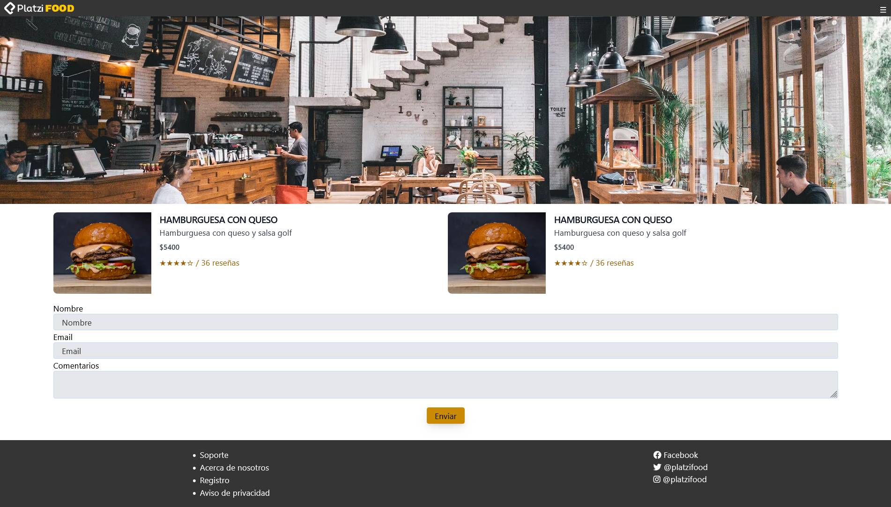

# PlatziFood

Proyecto PlatziFood del curso Tailwind CSS 1 de la plataforma Platzi.
En este curso se utilizó HTML, Tailwind y librerías como AlpineJS que es una librería de JavaScript que permite 
incluir interactividad y dinamismo en las páginas web sin proceso de compilado.
También se utilizó NanoCSS que reduce el tamaño del CSS para su uso en entornos de producción

## Screenshots

